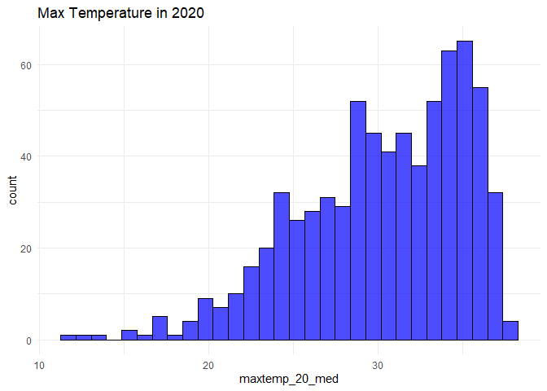
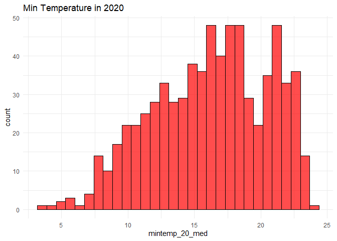
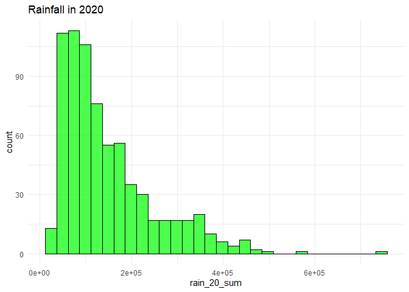
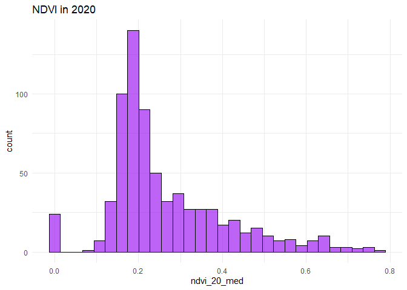
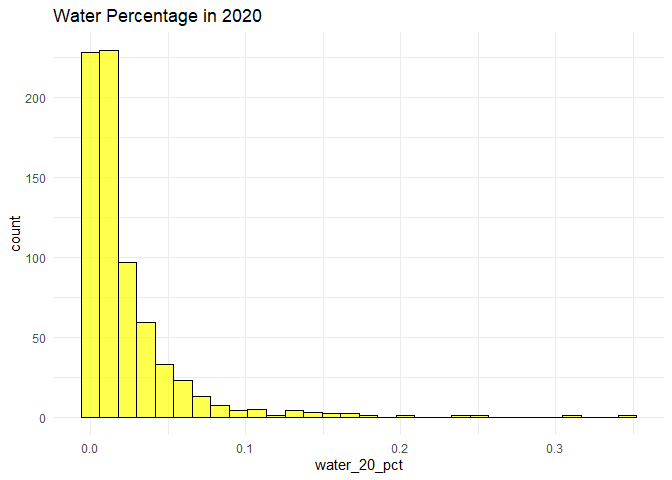
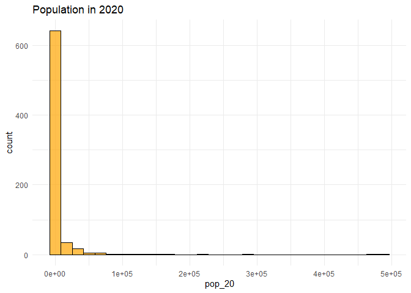
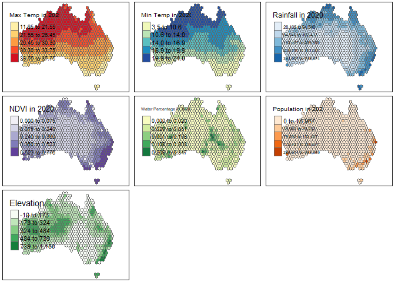
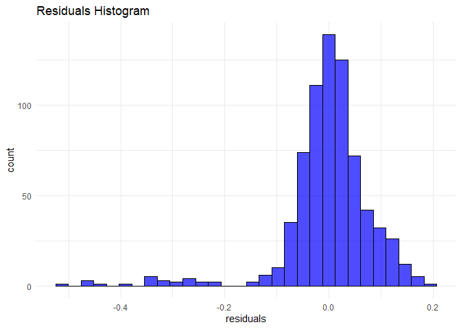
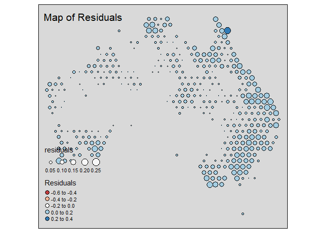

Geog6300: Lab 6
================

## Regression

``` r
library(sf)
library(tidyverse)
```

**Overview:** This lab focuses on regression techniques. You’ll be
analyzing the association of various physical and climatological
characteristics in Australia with observations of several animals
recorded on the citizen science app iNaturalist.

\###Data and research questions###

Let’s import the dataset.

``` r
lab6_data<-st_read("data/aus_climate_inat.gpkg")
```

    ## Reading layer `aus_climate_inat' from data source 
    ##   `C:\Users\peays\OneDrive\Documents\geog4-6300-lab-6-sgp2025\data\aus_climate_inat.gpkg' 
    ##   using driver `GPKG'
    ## Simple feature collection with 716 features and 22 fields
    ## Geometry type: POLYGON
    ## Dimension:     XY
    ## Bounding box:  xmin: 113.875 ymin: -43.38632 xmax: 153.375 ymax: -11.92074
    ## Geodetic CRS:  WGS 84 (CRS84)

The dataset for this lab is a 1 decimal degree hexagon grid that has
aggregate statistics for a number of variables:

- ndvi: NDVI/vegetation index values from Landsat data (via Google Earth
  Engine). These values range from -1 to 1, with higher values
  indicating more vegetation.
- maxtemp_00/20_med: Median maximum temperature (C) in 2000 or 2020
  (data from SILO/Queensland government)
- mintemp_00/20_med: Median minimum temperature (C) in 2020 or 2020
  (data from SILO/Queensland government)
- rain_00/20_sum: Total rainfall (mm) in 2000 or 2020 (data from
  SILO/Queensland government)
- pop_00/20: Total population in 2000 or 2020 (data from NASA’s Gridded
  Population of the World)
- water_00/20_pct: Percentage of land covered by water at some point
  during the year in 2000 or 2020
- elev_med: Median elevation (meters) (data from the Shuttle Radar
  Topography Mission/NASA)

There are also observation counts from iNaturalist for several
distinctively Australian animal species: the central bearded dragon, the
common emu, the red kangaroo, the agile wallaby, the laughing
kookaburra, the wombat, the koala, and the platypus.

Our primary research question is how the climatological/physical
variables in our dataset are predictive of the NDVI value. We will build
models for 2020 as well as the change from 2000 to 2020. The second is
referred to as a “first difference” model and can sometimes be more
useful for identifying causal mechanisms.

\###Part 1: Analysis of 2020 data###

We will start by looking at data for 2020.

**Question 1** *Create histograms for NDVI, max temp., min temp., rain,
and population, and water in 2020 as well as elevation. Based on these
graphs, assess the normality of these variables.*

``` r
library(dplyr)
library(ggplot2)
ggplot(lab6_data, aes(x = maxtemp_20_med)) + 
  geom_histogram(bins = 30, fill = "blue", color = "black", alpha = 0.7) + 
  ggtitle("Max Temperature in 2020") + 
  theme_minimal()
```

<!-- -->

``` r
ggplot(lab6_data, aes(x = mintemp_20_med)) + 
  geom_histogram(bins = 30, fill = "red", color = "black", alpha = 0.7) + 
  ggtitle("Min Temperature in 2020") + 
  theme_minimal()
```

<!-- -->

``` r
ggplot(lab6_data, aes(x = rain_20_sum)) + 
  geom_histogram(bins = 30, fill = "green", color = "black", alpha = 0.7) + 
  ggtitle("Rainfall in 2020") + 
  theme_minimal()
```

<!-- -->

``` r
ggplot(lab6_data, aes(x = ndvi_20_med)) + 
  geom_histogram(bins = 30, fill = "purple", color = "black", alpha = 0.7) + 
  ggtitle("NDVI in 2020") + 
  theme_minimal()
```

<!-- -->

``` r
ggplot(lab6_data, aes(x = water_20_pct)) + 
  geom_histogram(bins = 30, fill = "yellow", color = "black", alpha = 0.7) + 
  ggtitle("Water Percentage in 2020") + 
  theme_minimal()
```

<!-- -->

``` r
ggplot(lab6_data, aes(x = pop_20)) + 
  geom_histogram(bins = 30, fill = "orange", color = "black", alpha = 0.7) + 
  ggtitle("Population in 2020") + 
  theme_minimal()
```

<!-- -->

{None of these have normal distributions, but some are more normal than
others, like minimum temperature and NDVI.}

**Question 2** *Use tmap to map these same variables using Jenks natural
breaks as the classification method. For an extra challenge, use
`tmap_arrange` to plot all maps in a single figure.*

``` r
library(tmap)
```

    ## Breaking News: tmap 3.x is retiring. Please test v4, e.g. with
    ## remotes::install_github('r-tmap/tmap')

``` r
map_maxtemp <- tm_shape(lab6_data) +
  tm_fill("maxtemp_20_med", palette = "YlOrRd", style = "jenks", title = "Max Temp in 2020") +
  tm_borders()
map_mintemp <- tm_shape(lab6_data) +
  tm_fill("mintemp_20_med", palette = "YlGnBu", style = "jenks", title = "Min Temp in 2020") +
  tm_borders()
map_rain <- tm_shape(lab6_data) +
  tm_fill("rain_20_sum", palette = "Blues", style = "jenks", title = "Rainfall in 2020") +
  tm_borders()
map_ndvi <- tm_shape(lab6_data) +
  tm_fill("ndvi_20_med", palette = "Purples", style = "jenks", title = "NDVI in 2020") +
  tm_borders()
map_water <- tm_shape(lab6_data) +
  tm_fill("water_20_pct", palette = "YlGn", style = "jenks", title = "Water Percentage in 2020") +
  tm_borders()
map_pop <- tm_shape(lab6_data) +
  tm_fill("pop_20", palette = "Oranges", style = "jenks", title = "Population in 2020") +
  tm_borders()
map_elevation <- tm_shape(lab6_data) +
  tm_fill("elev_med", palette = "Greens", style = "jenks", title = "Elevation") +
  tm_borders()
tmap_arrange(map_maxtemp, map_mintemp, map_rain, map_ndvi, map_water, map_pop, map_elevation, ncol = 3)
```

    ## Legend labels were too wide. The labels have been resized to 0.56, 0.56, 0.56, 0.56, 0.56. Increase legend.width (argument of tm_layout) to make the legend wider and therefore the labels larger.

    ## Legend labels were too wide. The labels have been resized to 0.48, 0.44, 0.41, 0.41, 0.41. Increase legend.width (argument of tm_layout) to make the legend wider and therefore the labels larger.

    ## Legend labels were too wide. The labels have been resized to 0.56, 0.56, 0.56, 0.56, 0.56. Increase legend.width (argument of tm_layout) to make the legend wider and therefore the labels larger.
    ## Legend labels were too wide. The labels have been resized to 0.56, 0.56, 0.56, 0.56, 0.56. Increase legend.width (argument of tm_layout) to make the legend wider and therefore the labels larger.

    ## Some legend labels were too wide. These labels have been resized to 0.48, 0.44, 0.41, 0.41. Increase legend.width (argument of tm_layout) to make the legend wider and therefore the labels larger.

    ## Some legend labels were too wide. These labels have been resized to 0.64. Increase legend.width (argument of tm_layout) to make the legend wider and therefore the labels larger.

<!-- -->

**Question 3** *Based on the maps from question 3, summarise major
patterns you see in the spatial distribution of these data from any of
your variables of interest. How do they appear to be associated with the
NDVI variable?*

{The coasts, notably the eastern, southeastern, and southwestern coasts,
unsurprisingly have the highest NDVI, since the vast majority of inland
Australia is the Outback. Population and rainfall line up with it a lot,
and they are in more temperate areas with lower maximum and higher
minium temperatures.}

**Question 4** *Create univariate models for each of the variables
listed in question 1, with NDVI in 2020 as the dependent variable. Print
a summary of each model. Write a summary of those results that indicates
the direction, magnitude, and significance for each model coefficient.*

``` r
model_maxtemp <- lm(ndvi_20_med ~ maxtemp_20_med, data = lab6_data)
model_mintemp <- lm(ndvi_20_med ~ mintemp_20_med, data = lab6_data)
model_rain <- lm(ndvi_20_med ~ rain_20_sum, data = lab6_data)
model_pop <- lm(ndvi_20_med ~ pop_20, data = lab6_data)
model_water <- lm(ndvi_20_med ~ water_20_pct, data = lab6_data)
model_elevation <- lm(ndvi_20_med ~ elev_med, data = lab6_data)
summary(model_maxtemp)
```

    ## 
    ## Call:
    ## lm(formula = ndvi_20_med ~ maxtemp_20_med, data = lab6_data)
    ## 
    ## Residuals:
    ##      Min       1Q   Median       3Q      Max 
    ## -0.41874 -0.07657 -0.01927  0.06833  0.36382 
    ## 
    ## Coefficients:
    ##                  Estimate Std. Error t value Pr(>|t|)    
    ## (Intercept)     0.6612389  0.0294372   22.46   <2e-16 ***
    ## maxtemp_20_med -0.0130902  0.0009601  -13.63   <2e-16 ***
    ## ---
    ## Signif. codes:  0 '***' 0.001 '**' 0.01 '*' 0.05 '.' 0.1 ' ' 1
    ## 
    ## Residual standard error: 0.1251 on 714 degrees of freedom
    ## Multiple R-squared:  0.2066, Adjusted R-squared:  0.2055 
    ## F-statistic: 185.9 on 1 and 714 DF,  p-value: < 2.2e-16

``` r
summary(model_mintemp)
```

    ## 
    ## Call:
    ## lm(formula = ndvi_20_med ~ mintemp_20_med, data = lab6_data)
    ## 
    ## Residuals:
    ##      Min       1Q   Median       3Q      Max 
    ## -0.36375 -0.08418 -0.03047  0.06972  0.40383 
    ## 
    ## Coefficients:
    ##                 Estimate Std. Error t value Pr(>|t|)    
    ## (Intercept)     0.464461   0.018997   24.45   <2e-16 ***
    ## mintemp_20_med -0.012282   0.001131  -10.86   <2e-16 ***
    ## ---
    ## Signif. codes:  0 '***' 0.001 '**' 0.01 '*' 0.05 '.' 0.1 ' ' 1
    ## 
    ## Residual standard error: 0.1301 on 714 degrees of freedom
    ## Multiple R-squared:  0.1418, Adjusted R-squared:  0.1406 
    ## F-statistic:   118 on 1 and 714 DF,  p-value: < 2.2e-16

``` r
summary(model_rain)
```

    ## 
    ## Call:
    ## lm(formula = ndvi_20_med ~ rain_20_sum, data = lab6_data)
    ## 
    ## Residuals:
    ##      Min       1Q   Median       3Q      Max 
    ## -0.56681 -0.04753 -0.01210  0.04599  0.30930 
    ## 
    ## Coefficients:
    ##              Estimate Std. Error t value Pr(>|t|)    
    ## (Intercept) 1.303e-01  7.060e-03   18.45   <2e-16 ***
    ## rain_20_sum 9.124e-07  3.953e-08   23.08   <2e-16 ***
    ## ---
    ## Signif. codes:  0 '***' 0.001 '**' 0.01 '*' 0.05 '.' 0.1 ' ' 1
    ## 
    ## Residual standard error: 0.1063 on 714 degrees of freedom
    ## Multiple R-squared:  0.4273, Adjusted R-squared:  0.4265 
    ## F-statistic: 532.6 on 1 and 714 DF,  p-value: < 2.2e-16

``` r
summary(model_pop)
```

    ## 
    ## Call:
    ## lm(formula = ndvi_20_med ~ pop_20, data = lab6_data)
    ## 
    ## Residuals:
    ##      Min       1Q   Median       3Q      Max 
    ## -0.47003 -0.07883 -0.03949  0.06384  0.48974 
    ## 
    ## Coefficients:
    ##              Estimate Std. Error t value Pr(>|t|)    
    ## (Intercept) 2.552e-01  5.013e-03  50.902   <2e-16 ***
    ## pop_20      1.500e-06  1.500e-07   9.998   <2e-16 ***
    ## ---
    ## Signif. codes:  0 '***' 0.001 '**' 0.01 '*' 0.05 '.' 0.1 ' ' 1
    ## 
    ## Residual standard error: 0.1316 on 714 degrees of freedom
    ## Multiple R-squared:  0.1228, Adjusted R-squared:  0.1216 
    ## F-statistic: 99.97 on 1 and 714 DF,  p-value: < 2.2e-16

``` r
summary(model_water)
```

    ## 
    ## Call:
    ## lm(formula = ndvi_20_med ~ water_20_pct, data = lab6_data)
    ## 
    ## Residuals:
    ##      Min       1Q   Median       3Q      Max 
    ## -0.26898 -0.08838 -0.04838  0.06871  0.50911 
    ## 
    ## Coefficients:
    ##               Estimate Std. Error t value Pr(>|t|)    
    ## (Intercept)   0.268988   0.006287  42.781   <2e-16 ***
    ## water_20_pct -0.178263   0.154480  -1.154    0.249    
    ## ---
    ## Signif. codes:  0 '***' 0.001 '**' 0.01 '*' 0.05 '.' 0.1 ' ' 1
    ## 
    ## Residual standard error: 0.1403 on 714 degrees of freedom
    ## Multiple R-squared:  0.001862,   Adjusted R-squared:  0.0004636 
    ## F-statistic: 1.332 on 1 and 714 DF,  p-value: 0.2489

``` r
summary(model_elevation)
```

    ## 
    ## Call:
    ## lm(formula = ndvi_20_med ~ elev_med, data = lab6_data)
    ## 
    ## Residuals:
    ##      Min       1Q   Median       3Q      Max 
    ## -0.27082 -0.09585 -0.04270  0.07954  0.44272 
    ## 
    ## Coefficients:
    ##              Estimate Std. Error t value Pr(>|t|)    
    ## (Intercept) 2.138e-01  9.741e-03  21.952  < 2e-16 ***
    ## elev_med    1.787e-04  2.895e-05   6.171 1.14e-09 ***
    ## ---
    ## Signif. codes:  0 '***' 0.001 '**' 0.01 '*' 0.05 '.' 0.1 ' ' 1
    ## 
    ## Residual standard error: 0.1369 on 714 degrees of freedom
    ## Multiple R-squared:  0.05064,    Adjusted R-squared:  0.04931 
    ## F-statistic: 38.08 on 1 and 714 DF,  p-value: 1.136e-09

{Maximum and minumum temperatures have negative relationships with the
NDVA and a small but significant magnitudes. For every increase in one
degree, NDVI is expected to decrease by 0.0131 for maximum temperature
and 0.0123 for the minimum. Both p-values are \<2e-16, meaning there is
a highly significant relationship. Rainfall, population, and elevation
have positive relationships with the NDVA and very small but significant
magnitudes. For an increase in 1,000 mm of rainfall every year, the
NVDIA is expected to go up by 0.0009124. For every 1,000 more people,
the NDVI goes up by 0.015. And finally, for every 1 meter of elevation,
the NDVI increases by 0.0001787. All of these variables have very low
p-values, meaning they have high significance. Water has a negative
relationship but no significant magnitude, as its p-value is 0.249, much
higher than the 0.05 threshold.}

**Question 5** *Create a multivariate regression model with the
variables of interest, choosing EITHER max or min temperature (but not
both) You may also choose to leave out any variables that were
insignificant in Q4. Use the univariate models as your guide. Call the
results.*

``` r
model_multivariate <- lm(ndvi_20_med ~ maxtemp_20_med + rain_20_sum + pop_20 + elev_med, data = lab6_data)
summary(model_multivariate)
```

    ## 
    ## Call:
    ## lm(formula = ndvi_20_med ~ maxtemp_20_med + rain_20_sum + pop_20 + 
    ##     elev_med, data = lab6_data)
    ## 
    ## Residuals:
    ##      Min       1Q   Median       3Q      Max 
    ## -0.50217 -0.02838  0.00409  0.03919  0.20570 
    ## 
    ## Coefficients:
    ##                  Estimate Std. Error t value Pr(>|t|)    
    ## (Intercept)     4.571e-01  2.194e-02  20.828  < 2e-16 ***
    ## maxtemp_20_med -1.170e-02  6.796e-04 -17.220  < 2e-16 ***
    ## rain_20_sum     8.469e-07  3.263e-08  25.953  < 2e-16 ***
    ## pop_20          2.862e-07  1.044e-07   2.741  0.00627 ** 
    ## elev_med        1.233e-04  1.796e-05   6.864 1.46e-11 ***
    ## ---
    ## Signif. codes:  0 '***' 0.001 '**' 0.01 '*' 0.05 '.' 0.1 ' ' 1
    ## 
    ## Residual standard error: 0.0845 on 711 degrees of freedom
    ## Multiple R-squared:  0.6397, Adjusted R-squared:  0.6376 
    ## F-statistic: 315.5 on 4 and 711 DF,  p-value: < 2.2e-16

**Question 6** *Summarize the results of the multivariate model. What
are the direction, magnitude, and significance of each coefficient? How
did it change from the univariate models you created in Q4 (if at all)?
What do the R2 and F-statistic values tell you about overall model fit?*

{Maximum temperature, rainfall, population, and elevation all have
significant effects on the NDVI. The maximum temperature has a negative
influence while the other three have positive influences. The R2
indicates a 64% significance value, which is very strong, and the
F-statistic is very high at 315.5, suggesting that these factors are
statistically significant. While there is a slight shift in the
multivariate model compared to the univariate model in question 4, which
is expected as the multivariate model accounts for the combined effects
of multiple predictors, which can cause the apparent influence of each
individual predictor to adjust. These changes in magnitude suggest that
these factors may have been confounded in the univariate models, and
controlling for them provides a clearer picture of the relationships.
Despite these changes, in coefficient magnitude, the relationships
between the variables and NDVI remained consistent in terms of direction
(positive or negative) and statistical significance.}

**Question 7** *Use a histogram and a map to assess the normality of
residuals and any spatial autocorrelation. Summarise any notable
patterns that you see.*

``` r
residuals_mv <- residuals(model_multivariate)
ggplot(data.frame(residuals = residuals_mv), aes(x = residuals)) +
  geom_histogram(bins = 30, fill = "blue", color = "black", alpha = 0.7) +
  ggtitle("Residuals Histogram") +
  theme_minimal()
```

<!-- -->

``` r
lab6_data$residuals <- residuals_mv
tm_shape(lab6_data) +
  tm_style("gray") + 
  tm_symbols(col = "residuals", size = "residuals", 
             palette = "RdBu", 
             midpoint = NA, 
             title.col = "Residuals", 
             border.col = "black") +
  tm_layout(title = "Map of Residuals")
```

<!-- -->

{Most large residuals tend to be between 0.0 and 0.2 for direction and
the ones with the highest magnitudes are near the eastern and
southeastern coasts.}

**Question 8** *Assess any issues with multicollinearity or
heteroskedastity in this model using the techniques shown in class. Run
the appropriate tests and explain what their results show you.*

``` r
library(car)
```

    ## Warning: package 'car' was built under R version 4.4.2

    ## Loading required package: carData

    ## Warning: package 'carData' was built under R version 4.4.2

    ## 
    ## Attaching package: 'car'

    ## The following object is masked from 'package:dplyr':
    ## 
    ##     recode

    ## The following object is masked from 'package:purrr':
    ## 
    ##     some

``` r
vif(model_multivariate)
```

    ## maxtemp_20_med    rain_20_sum         pop_20       elev_med 
    ##       1.098705       1.078449       1.173863       1.009305

``` r
library(lmtest)
```

    ## Warning: package 'lmtest' was built under R version 4.4.2

    ## Loading required package: zoo

    ## Warning: package 'zoo' was built under R version 4.4.2

    ## 
    ## Attaching package: 'zoo'

    ## The following objects are masked from 'package:base':
    ## 
    ##     as.Date, as.Date.numeric

``` r
bptest(model_multivariate)
```

    ## 
    ##  studentized Breusch-Pagan test
    ## 
    ## data:  model_multivariate
    ## BP = 122.21, df = 4, p-value < 2.2e-16

{All the VIF values are much fewer than 5, being just above 1, meaning
there are no multicollinearity issues. The p-value of \<2.2e-16 is
exponentially less than 0.05, indicating that there is heteroskedastity
present. }

**Question 9** *How would you summarise the results of this model in a
sentence or two? In addition, looking at the full model and your
diagnostics, do you feel this is a model that provides meaningful
results? Explain your answer.*

{The NDVA of different parts of Australia is heavily influenced by the
maximum temperature, rainfall, elevation, and population because of the
R2 of 0.64. Though no multicollinearity, there is heteroskadastity
meaning there isn’t a constant variance and might not follow the pattern
as closely as the model suggests.}

**Disclosure of assistance:** *Besides class materials, what other
sources of assistance did you use while completing this lab? These can
include input from classmates, relevant material identified through web
searches (e.g., Stack Overflow), or assistance from ChatGPT or other AI
tools. How did these sources support your own learning in completing
this lab?*

{I used ChatGPT for questions 2 and 7, and video tutorials for the other
questions.}

**Lab reflection:** *How do you feel about the work you did on this lab?
Was it easy, moderate, or hard? What were the biggest things you learned
by completing it?*

{It was harder than the last lab but still fairly easy, so I’ll call
this one moderate. I learned how to create and organize a large number
of models and be able to relate them.}

**Challenge question**

\#Option 1 Create a first difference model. To do that, subtract the
values in 2000 from the values in 2020 for each variable for which that
is appropriate. Then create a new model similar to the one you created
in question 5, but using these new variables showing the *change in
values* over time. Call the results of the model, and interpret the
results in the same ways you did above. Also chart and map the residuals
to assess model error. Finally, write a short section that summarises
what, if anything, this model tells you.

\#Option 2 The animal data included in this dataset is an example of
count data, and usually we would use a Poisson or similar model for that
purpose. Let’s try it with regular OLS regression though. Create two
regression models to assess how the counts of two different animals
(say, koalas and emus) are associated with at least three of the
environmental/climatological variables given above. Be sure to use the
same independent variables in each model. Interpret the results of each
model and then explain the importance of any differences in the model
coefficients between them, focusing on direction, magnitude, and
significance.
